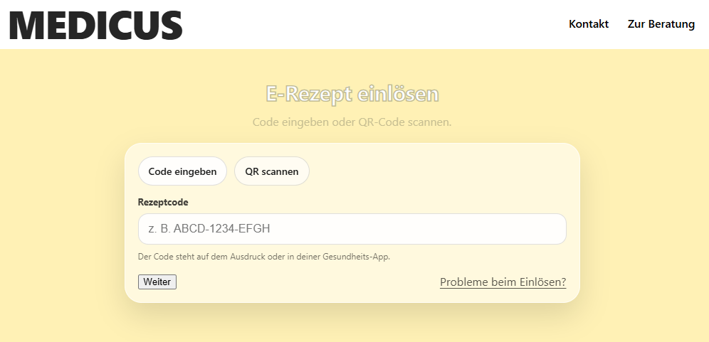

# Online Pharmacy Counseling Assistant (WIP)

**Why this project?**

Online pharmacies often lack structured counseling.
This project demonstrates how a backend-driven counseling assistant
can generate patient-specific guidance from e-prescriptions and history.
---
A demo project that shows how digital medication counseling can work in an online pharmacy:
- **E-prescription intake** → structured counseling plan (patient context, history, alerts, checklist)
- **Symptom-based counseling (planned)** → category selection (cold, stomach, etc.) with red-flag guidance

> Status: Work in progress — core backend + initial frontend navigation are implemented.

---

## Screenshots

### Home


### E-Prescription page (prototype)


---

## Tech Stack

- Java 17+ (Spring Boot)
- PostgreSQL (Docker)
- JPA / Hibernate
- REST API (DTO-based)
- HTML / CSS / JavaScript (prototype frontend)

---

## Architecture Overview

**Flow**
- Browser (static pages) → REST Controller → Service (business logic) → Repository (DB) → Response DTO → Browser

**Layers**
- `model/` – JPA entities (Patient, Medication, Prescription, DispenseEvent)
- `repository/` – Spring Data repositories (DB access)
- `service/` – counseling logic (age, history, alerts, checklist)
- `dto/` – request/response objects for the API
- `controller/` – REST endpoints

---

## Features

### Implemented
- PostgreSQL running via Docker
- SQL-first schema (`schema.sql`) + sample data (`data.sql`)
- E-prescription counseling endpoint: `POST /api/counseling/erezept`
- Frontend prototype with separate pages:
    - `/` (home)
    - `/erezept.html`
    - `/beratung.html` (UI prototype)

### Planned
- Symptom-based counseling endpoint: `POST /api/counseling/symptoms`
- Better UI rendering of the counseling result (cards, badges, checklist)
- More counseling rules (red flags, interactions, special populations)

---

## Run Locally

### 1) Start PostgreSQL (Docker)
```bash
docker run --name pta-postgres -e POSTGRES_PASSWORD=pta_pass -e POSTGRES_USER=pta_user -e POSTGRES_DB=pta_db -p 5432:5432 -d postgres:16
